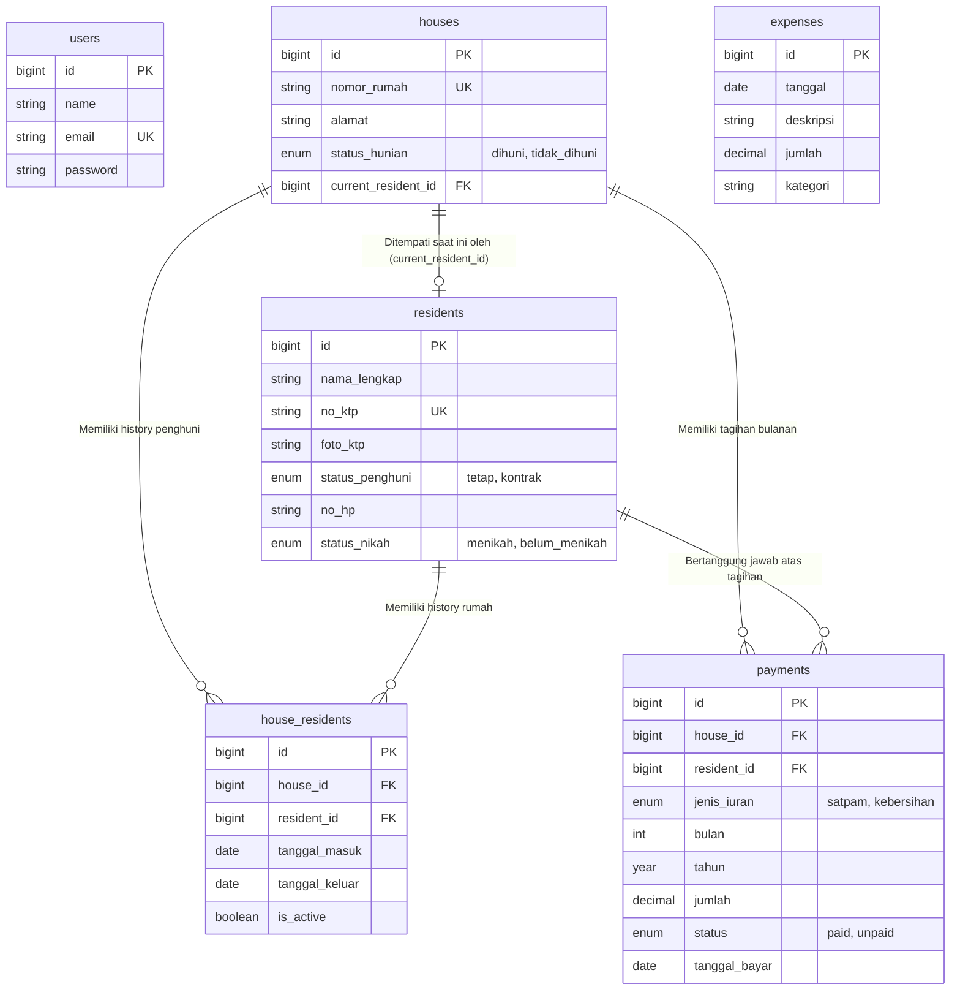

# Sistem Administrasi RT Perumahan Elite
**Skill Fit Test - Full Stack Programmer Apprentice**

Sistem ini adalah aplikasi manajemen iuran dan data warga tingkat rukun tetangga (RT) untuk perumahan elite yang dibangun terpisah (Headless API) menggunakan **Laravel 13** dan antarmuka single-page application (SPA) menggunakan **React 18 & Vite**.

## Fitur Utama

- **Dashboard**: Statistik realtime pendapatan, pengeluaran, saldo, serta grafik interaktif riwayat transaksi 12 bulan terakhir.
- **Manajemen Penghuni**: CRUD data penghuni tetap dan kontrak beserta upload KTP.
- **Manajemen Rumah**: Pengelolaan 20 rumah beserta riwayat historis (keluar/masuk) penghuni yang menempatinya.
- **Manajemen Iuran**: Penagihan iuran satpam dan kebersihan, integrasi "1-click Bulk Generate" untuk tagihan bulanan seluruh warga yang menempati rumah, dan manajemen penerimaan (Bayar Lunas).
- **Manajemen Pengeluaran**: Pengarsipan kas keluar yang terekam sempurna setiap tanggal beserta kategori penggunaannya.

---

## 🛠 Tech Stack
- **Backend:** Laravel 13, PHP 8.3, MySQL / MariaDB, Sanctum (API Authentication)
- **Frontend:** React 18, Vite, Tailwind CSS v4, Axios, React Router v7, Recharts, Lucide React

---

## 📦 1. Lengkap Instalasi Guide (Panduan Instalasi)

⚠️ **Mohon ikuti langkah-langkah di bawah ini secara persis agar aplikasi berjalan sempurna tanpa peringatan error (disqualification free).**

### A. Persiapan Lingkungan Sistem
Pastikan Anda sudah menginstal:
- PHP 8.3 atau terbaru
- Composer
- Node.js (Minimal versi 18+)
- MySQL atau MariaDB (via XAMPP, Laragon, dsb.)
- Git

### B. Konfigurasi Backend (Laravel)
1. Buka terminal/command prompt, navigasikan ke folder `backend`:
   ```bash
   cd backend
   ```
2. Karena proyek ini baru diunduh, buat file `.env` dari `.env.example` (jika belum ada):
   ```bash
   cp .env.example .env
   ```
3. Buat database baru di MySQL dengan nama: **iuran_perumahan**
4. Install dependensi composer:
   ```bash
   composer install
   ```
5. Generate application key:
   ```bash
   php artisan key:generate
   ```
6. Jalankan migrasi tabel beserta *dummy data* (20 Rumah, 20 Penghuni, Iuran historis, dan Pengeluaran):
   ```bash
   php artisan migrate:fresh --seed
   ```
7. *Link* folder storage (Penting untuk upload KTP & Bukti bayar):
   ```bash
   php artisan storage:link
   ```
8. Jalankan server Backend API di port standard (8000):
   ```bash
   php artisan serve
   ```

### C. Konfigurasi Frontend (React)
1. Buka terminal **baru** (biarkan terminal Backend tetap berjalan).
2. Pindah ke direktori frontend:
   ```bash
   cd frontend
   ```
3. Install dependensi NPM:
   ```bash
   npm install
   ```
4. Jalankan server frontend Vite:
   ```bash
   npm run dev
   ```
   *Frontend akan otomatis terbuka di `http://localhost:5173` atau Anda dapat mengakses link tersebut secara manual di browser.*

### D. Akses Aplikasi
- Buka URL: [http://localhost:5173](http://localhost:5173) di Browser.
- Login menggunakan kredensial dummy berikut:
  - **Email:** `admin@rt.com`
  - **Password:** `password`

---

## 📊 2. Entity Relationship Diagram (ERD)

Aplikasi ini menggunakan skema relasional yang mengikat satu rumah dan penghuninya secara historikal (`house_residents`), serta tabel pembayaran yang independen dengan validasi constraints.



## Referensi & Kontribusi
Dikembangkan sebagai Studi Kasus Jagoan Hosting / RT Administrative Management System.
